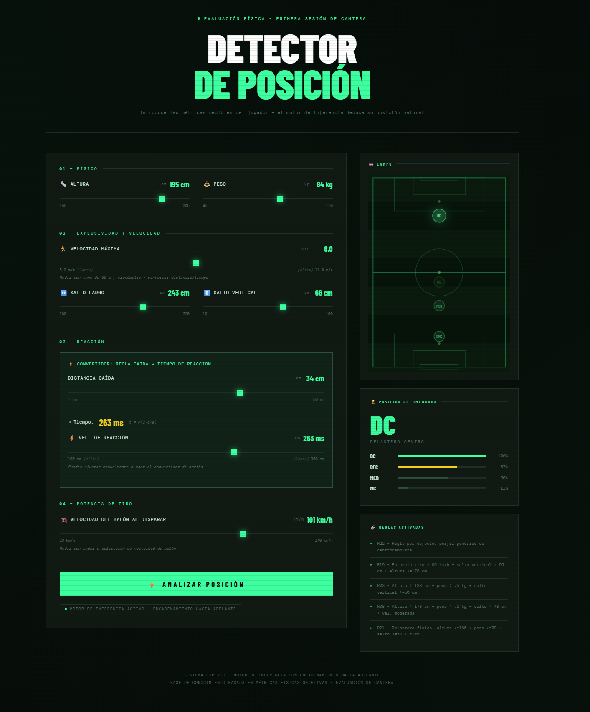

# ⚽ Sistema Experto de Cantera de Fútbol

Un detector inteligente que **analiza las características físicas de un jugador y te dice automáticamente qué posición es la mejor para él**.

---

## 🚀 Inicio Rápido (3 pasos)

### 1️⃣ Instalar
```bash
python -m venv venv
.\venv\Scripts\Activate.ps1  # Windows
pip install Flask experta
```

### 2️⃣ Ejecutar
```bash
python app.py
```

### 3️⃣ Usar
Abre en el navegador: **http://127.0.0.1:5000**

---

## 📊 ¿Cómo funciona?

**Es muy simple:**

1. **Introduces 7 métricas** del jugador usando los sliders:
   - Altura, peso, velocidad, saltos, reacción, potencia de tiro

2. **Haces clic en "⚡ ANALIZAR POSICIÓN"**

3. **Recibes el resultado** → Te muestra qué posición es la mejor para ese jugador con una puntuación

**Ejemplo:**
- Jugador rápido (9.2 m/s) + Reacción rápida (165 ms) + Salto largo (235 cm)
- → **Resultado: EXTREMO DERECHO** ✅

---

## 🧠 ¿Qué hay dentro? (La magia)

El sistema usa un **motor de reglas** que funciona así:

```python
# El sistema tiene 18+ reglas como esta:

"Si el jugador tiene:
  - Velocidad >= 9.0 m/s
  - Reacción <= 170 ms
  - Salto largo >= 230 cm
 ENTONCES → Es EXTREMO DERECHO"
```

Todas las reglas se evalúan, se suman los puntos, y **la posición con más puntos gana**.

---

## 📋 Las 7 Métricas

| Métrica | Rango | ¿Para qué sirve? |
|---------|-------|-----------------|
| **Altura** | 155–205 cm | Diferencia entre portero y extremo |
| **Peso** | 45–110 kg | Indica fuerza física |
| **Velocidad** | 6–10 m/s | Importante para extremos y laterales |
| **Salto horizontal** | 180–250 cm | Capacidad explosiva |
| **Salto vertical** | 40–65 cm | Importante para defensores y delanteros |
| **Reacción** | 130–200 ms | Crítico para porteros y mediapuntas |
| **Potencia tiro** | 50–100 km/h | Para delanteros y mediapuntas |

---

## 🏃 Posiciones que detecta

**12 posiciones**: Portero · Defensa Central · Lateral Derecho · Lateral Izquierdo · Mediocampista Defensivo · Mediocampista Central · Mediocampista Derecho · Mediocampista Izquierdo · Mediocampista Ofensivo · Extremo Derecho · Extremo Izquierdo · Delantero Centro

---

## 📁 Estructura (simple)

```
Sistema_Experto/
├── app.py                 ← Servidor (lo que ejecutas)
├── sistema_experto.py     ← Motor de reglas
├── templates/
│   └── index.html         ← Pantalla del usuario
└── static/
    ├── style.css          ← Diseño bonito
    └── app.js             ← Botones interactivos
```

**Flujo:**
```
Usuario introduce datos en HTML
        ↓
JavaScript envía datos a Flask
        ↓
Motor Experta evalúa 18+ reglas
        ↓
Devuelve posición + puntuación
        ↓
Se muestra en pantalla
```

---

## ⚙️ Tecnologías usadas

- **Flask**: Servidor web que recibe datos y devuelve resultados
- **Experta**: Motor de reglas (lo que hace la "magia")
- **HTML/CSS/JavaScript**: La pantalla del usuario

---

## 💡 Ejemplo de uso real

**Entras estos datos:**
- Altura: 182 cm
- Peso: 75 kg
- Velocidad: **9.2 m/s** (rápido)
- Salto horizontal: **235 cm** (potente)
- Salto vertical: 52 cm
- Reacción: **165 ms** (rápido)
- Tiro: 85 km/h

**El sistema evalúa todas las reglas:**
- ✅ Cumple regla del Extremo Derecho
- ✅ Cumple regla del Mediapunta
- ❌ No cumple regla del Portero

**Resultado:** **EXTREMO DERECHO** con 3.5 puntos

---

## 📝 Notas importantes

- ⚠️ Los datos **no se guardan**, cada análisis es independiente
- 🔍 El resultado siempre muestra **qué reglas se activaron** (es explicable)
- 🎮 Los sliders son interactivos en tiempo real
- 📱 Funciona en cualquier navegador moderno

---

**¡Listo! Ahora puedes analizar jugadores de cantera automáticamente** ⚽✨


